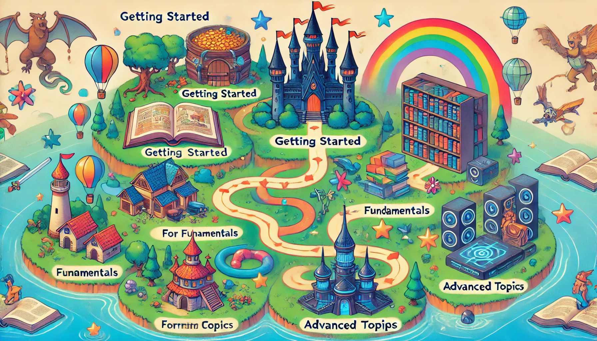

# Introduction: The Adventure Begins

## Welcome Message

Welcome, aspiring C++ adventurer! 🎉

You've just embarked on an exciting journey to master C++, one of the most powerful and versatile programming languages.
Whether you're a complete beginner or a seasoned developer aiming to expand your skills, this guide is crafted to be
your trusty companion on this adventure.

## Overview of the Journey

Think of this guide as your RPG (Role-Playing Game) 🎮, where each level you conquer brings you closer to becoming a C++
master. We'll begin with the essentials, setting up your environment and writing your first lines of code. As you
progress, you'll tackle increasingly challenging missions and face formidable boss fights that will test your knowledge
and skills.

Here's a glimpse of what lies ahead:

- **Level 1**: Getting Started with C++ 🐍
    - Set up your environment and write your first C++ program.
    - Understand basic syntax, variables, and control structures.
- **Level 2**: Mastering C++ Fundamentals 📚
    - Dive into functions, namespaces, and dynamic memory management.
- **Level 3**: Object-Oriented Programming 🚀
    - Explore classes, inheritance, polymorphism, and templates.
- **And many more levels!** Each packed with missions and boss fights that will elevate your C++ prowess to new heights.

Along the way, you'll encounter real-world projects and applications, ensuring that what you learn is immediately
applicable and practical. By the end of this journey, you'll be equipped with the skills and confidence to tackle any
C++ project thrown your way.



## How to Use This Guide

This guide is structured like a game, with each level representing a new area of mastery. Here’s how to navigate it:

1. **Start at Level 1**: Even if you have some C++ experience, beginning at the first level ensures you have a solid
   foundation.
2. **Complete Missions**: Each level is divided into missions. Complete each mission in sequence to build your knowledge
   step-by-step.
3. **Face Boss Fights**: At the end of each mission, you'll encounter a boss fight – a challenging project or problem
   that tests what you've learned.
4. **Use Resources**: Throughout the guide, you'll find links to additional resources, tips, and best practices. Don’t
   skip these – they're here to help you succeed!
5. **Ask for Help**: If you get stuck, don’t hesitate to seek help. Join C++ communities, ask questions, and collaborate
   with others. Coding is a team sport!

> Take regular breaks while coding. Taking a short break every hour can significantly improve your focus and quality of your code.
> Don’t rush through the levels. Each level is designed to give you a deeper understanding of C++. Try to fully understand the content before moving on to the next level.
> Experiment with the code. Don’t be afraid to make mistakes. That’s part of the learning process.
{style="note"}

```C++
#include <iostream>
using namespace std;

void greet_world(const string &name) {
    // Print a hello world message
    cout << "Hello, " << name << " World!" << endl;
}

int main() {
    // Call the greet_world function with 'C++' as argument
    greet_world("C++");
    return 0;
}
```
Output
```text
Hello, C++ World!
```

I believe that learning should be fun, engaging, and rewarding. So, keep your curiosity alive, experiment boldly, and
enjoy the ride. Ready to begin? Let’s dive in and start our C++ adventure!


Remember, this is your adventure. Customize it, take your time, and most importantly, have fun! Let's code! 🚀
